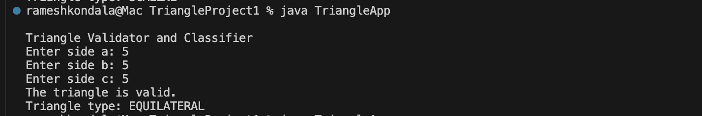
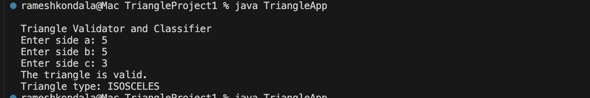
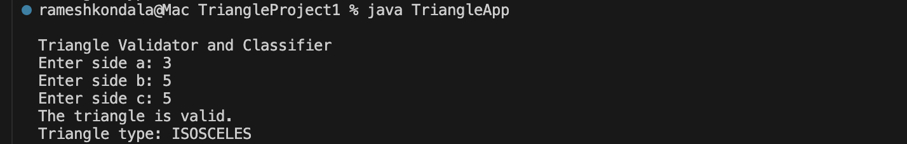
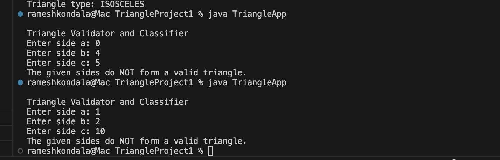

# Project 1: Unit Testing – Triangle Validator (Java)

## Introduction

This program verifies and categorizes a triangle based on three user-provided side lengths. It begins by confirming the triangle's validity through the triangle inequality theorem and checks for non-positive sides. Afterward, it classifies the triangle as equilateral, isosceles, scalene, or invalid. Input validation and simple conditional logic handle errors and exceptional cases such as zero or negative sides and non-numeric input. To ensure accuracy, I developed JUnit tests covering typical valid triangles and edge cases like invalid triangles, zero-length sides, and different side arrangements, boosting confidence in the program.

## Details of the Program

I used [IntelliJ IDEA / VS Code] as my IDE and implemented the project in Java with a typical `src/main` and `src/test` structure. The user inputs three side lengths through a console interface using the `Scanner` class, which prompts for each value. The program displays the results directly on the console, showing whether the triangle is valid and, if valid, its type. The `Triangle` class handles the validation and classification, while `TriangleApp` manages the interactive execution.

## Table with Example Test Data

| Sides (a, b, c) | Expected valid? | Expected type | Purpose                             |
|-----------------|-----------------|---------------|-------------------------------------|
| 3, 4, 5         | Yes             | SCALENE       | Typical valid scalene triangle      |
| 5, 5, 5         | Yes             | EQUILATERAL   | All sides equal                     |
| 5, 5, 3         | Yes             | ISOSCELES     | Two sides equal                     |
| 5, 3, 5         | Yes             | ISOSCELES     | Same isosceles, different order     |
| 3, 5, 5         | Yes             | ISOSCELES     | Same isosceles, different order     |
| 0, 4, 5         | No              | INVALID       | Zero length side (rainy day)        |
| 1, 2, 10        | No              | INVALID       | Fails triangle inequality           |

These values were used both manually via the console and programmatically in unit tests to verify correctness.

## Unit Tests

I wrote JUnit 5 tests in `TriangleTest` to cover both normal and rainy‑day scenarios:

- A test for a valid scalene triangle (3, 4, 5) to confirm the basic positive case.
- A test for an equilateral triangle (5, 5, 5) to ensure equal sides are classified correctly.
- A test for an isosceles triangle using permutations of (5, 5, 3), (5, 3, 5), and (3, 5, 5) to verify that side order does not affect the classification.
- A test with a zero‑length side (0, 4, 5) to ensure the triangle is treated as invalid.
- A test that violates the triangle inequality (1, 2, 10) to confirm the program correctly rejects impossible triangles.

I chose these tests because they represent classic examples from triangle classification problems and directly exercise the primary branches and edge cases in the validation logic.

## Bugs Encountered During Testing

At first, I only checked the triangle inequality without considering whether the sides were zero or negative, which led to mistakenly identifying a side with a length of 0 (like in the case of sides 0, 4, 5) as a valid triangle. To make it better, I added a clear check to ensure all sides are greater than zero before applying the triangle inequality. I also realized I wasn't handling non-numeric inputs properly, which caused the program to crash when someone entered letters. To fix this, I wrapped the input process in a `try/catch` block and added a friendly error message to guide users instead of having the program unexpectedly stop.

## Problems

The main challenges I faced were mostly about setting up the project and managing input handling. Setting up JUnit was a bit of a puzzle, as I needed to add the right dependency and source folder configurations in the IDE. On the logic side, it was a bit tricky initially to think through all those tricky edge cases—like negative numbers, zeros, or very unbalanced sides—and I had to double-check the specification to make sure I covered all invalid scenarios. Once I got the tests running, they really helped me catch and fix those problems quickly, making the process a lot smoother.

## Screen Shots

Below are screenshots demonstrating the program and tests (files are also included in the `screenshots` folder of the GitHub repo):

- 
- 
- 
- 
- 
- 
- 

