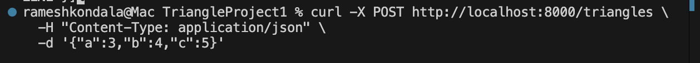
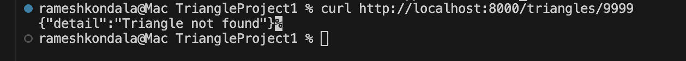

# Project 2: Integration Testing with Postman

## Introduction

This project centers on integration testing with APIs and Postman. The aim was to learn how a client interacts with a backend server through HTTP requests and receives JSON responses. I created a Triangle API using Python and Flask to imitate a real backend service.

I tested the API using Postman with various requests like GET, POST, and DELETE, making sure it responded correctly to different inputs. I also checked error cases to see how it handled invalid data, ensuring reliability. Additionally, I used curl commands from the terminal as an extra step to show another way to test the same API endpoints, which was quite helpful. This project was a great opportunity to connect the triangle logic from Project 1 with a functional web API for seamless integration testing.

***

## Part 1: Research on APIs and Integration Testing

### HTTP Functionality

HTTP (HyperText Transfer Protocol) is the main protocol used for communication between clients and servers on the web.

- **Client:** A client is the application that sends requests to a server. Examples include a browser, Postman, or curl.
- **Server:** A server receives requests, processes them, and returns responses.
- **Request:** A request contains a method such as GET, POST, PUT, or DELETE, along with headers and sometimes a body.
- **Response:** A response is the data returned by the server after processing the request.
- **Headers vs Body:** Headers contain metadata such as content type or authentication information. The body contains the actual data, often in JSON format.
- **Status Codes:** Common status codes include 200 for success, 201 for created, 404 for not found, 400 for bad request, and 500 for server error.
- **HTTP Verbs:**
  - GET: Retrieve data.
  - POST: Create data.
  - PUT: Update data.
  - DELETE: Remove data.

### Stateless Nature of HTTP

HTTP is stateless, so every request is handled independently, and the server doesn't automatically remember past requests. If a client sends two requests, the server treats each one separately unless we use additional tools like cookies, sessions, or tokens to help remember.

This stateless design simplifies HTTP and makes it easier to scale, as the server doesn't have to store data about each client connection. However, for applications requiring login sessions or user tracking, state is added via cookies, session IDs, JWT tokens, or similar techniques.

### Role of APIs in Modern Applications

APIs make it easy for various software systems to work together smoothly. In today’s apps, APIs help connect user interfaces, mobile applications, databases, and third-party services seamlessly. They gently hide the complex inner workings and only share the necessary methods and data that other programs require, making everything work together more effortlessly.

Open APIs are public interfaces that outside developers can access. They are crucial because they enable developers to add features more quickly without building everything from scratch. For instance, a weather app might use an open weather API to show forecasts, or a map app could use a map API for location information.

### Cross-Origin Resource Sharing (CORS)

CORS is a helpful browser security feature that decides which websites can access resources from another origin. An origin is made up of the protocol, domain, and port. Usually, browsers block cross-origin requests to keep things secure, thanks to the same-origin policy.

To allow another site to access the API, the server must send CORS headers such as:

- `Access-Control-Allow-Origin`
- `Access-Control-Allow-Methods`
- `Access-Control-Allow-Headers`

CORS is important when a frontend and backend are hosted on different domains or ports.

### API Security

APIs are often protected so that only authorized users or applications can access them. Common security methods include:

- **API keys:** A unique key is sent with the request to identify the client.
- **Authentication tokens:** Tokens such as JWT are used to prove the identity of the user.
- **HTTPS:** Encrypts communication between client and server.
- **OAuth 2.0:** Lets one service access another service securely without exposing passwords.

To access a secure API, I would need to provide valid credentials such as an API key or token, usually in the request headers.

### Public Open APIs

Some examples of public open APIs are:

- JSONPlaceholder
- OpenWeather API
- REST Countries API
- NASA API
- GitHub API

These APIs are useful for testing, learning, and building applications that need external data.

***

## Part 2: Postman Testing

### API Development

For this project, I developed a Triangle API using Python and Flask. The API accepts triangle side lengths and determines whether the triangle is valid and what type it is, such as Scalene, Isosceles, or Equilateral.

### Endpoints Used

| Method | Endpoint        | Description                  |
| ------ | --------------- | ---------------------------- |
| GET    | /triangles      | Retrieve all triangles        |
| POST   | /triangles      | Create a new triangle         |
| GET    | /triangles/{id} | Retrieve a specific triangle  |
| DELETE | /triangles/{id} | Delete a triangle             |

### Postman Setup

I created a Postman collection named **Triangle API Testing** and an environment named **Triangle Local**. I defined the environment variable:

- `url = http://127.0.0.1:8000`

All requests used `{{url}}` as the base URL so the collection could be reused easily.

***

## Example Requests and Responses

### 1. GET Request (All Triangles)

### 2. POST Request (Create Triangle)

### 3. GET Request by ID

### 4. Error Case

### 5. Additional Triangle Tests

I also tested several other triangle case.

#### Invalid Triangle

### Data Persistence

The API stores triangle data temporarily in memory. This means the data is not saved permanently. When the server stops and restarts, all triangle records are lost. This helped show CRUD behavior without requiring a database.

***

## Extra Credit: curl Testing

### GET Request using curl

### POST Request using curl

### GET Request using curl -triangle not found

### Advantages of curl

- Lightweight and fast.
- Useful for scripts and automation.
- Does not require a graphical interface.

***

## Conclusion and Recomendations

This project gave me hands-on experience with integration testing using APIs and Postman. I learned how HTTP requests and responses work, how API endpoints are tested, and how error cases are handled. Building the Triangle API helped connect the triangle logic from the previous project to a real backend service.

Postman made it easy to organize requests in a collection and reuse the base URL with an environment variable. The curl commands showed that the same API can also be tested directly from the terminal. Overall, this project improved my understanding of APIs, integration testing, and backend communication.

***

