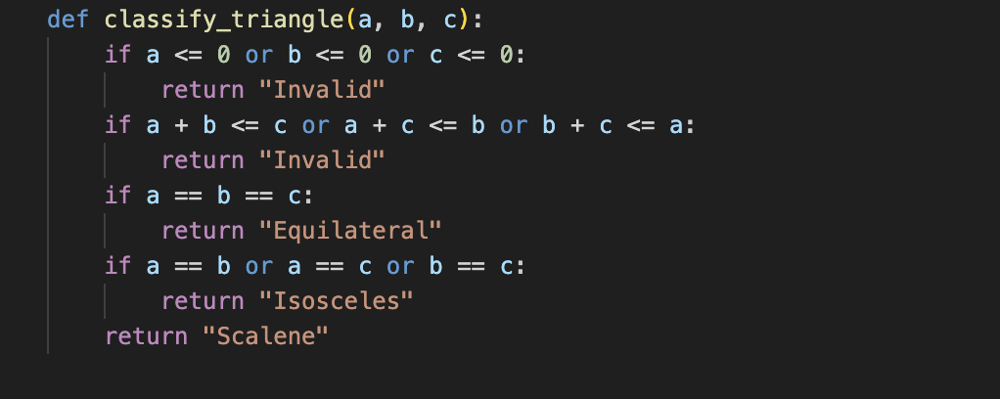
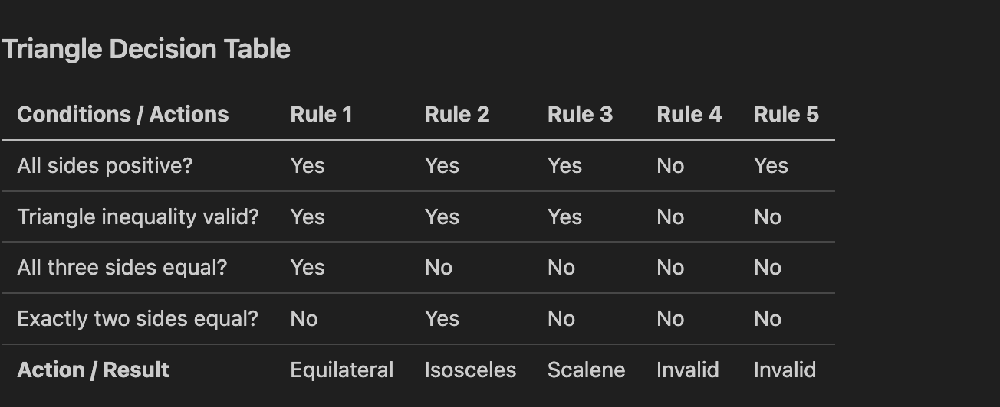
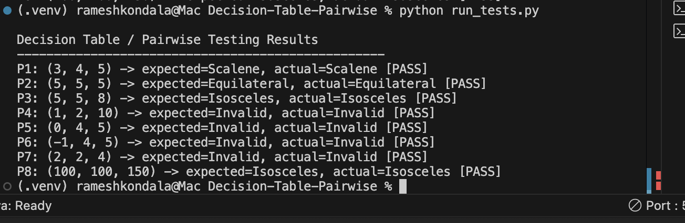
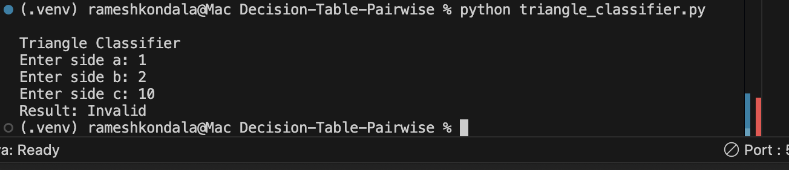

Decision table testing is used when outputs depend on combinations of conditions, whereas pairwise testing reduces the number of tests by covering every pair of input values at least once, rather than exhaustively testing all combinations.


# Vibe Coding Test Case Analysis

## Introduction

This assignment emphasizes **Decision Table Testing** and **Pairwise Testing**, key techniques in software test design for systems with various input conditions. Decision tables are effective when a program's behavior relies on combinations of logical conditions and their corresponding actions. Pairwise testing aims to minimize the number of test cases for software that accepts multiple inputs, ensuring all pairs of parameter values are tested.

Decision table testing is suitable when requirements can be described as rules, like "if these conditions are true, then this result should occur." Pairwise testing is appropriate when numerous input combinations exist and exhaustive testing is impractical due to size or time constraints. However, a limitation of pairwise testing is that it does not cover all three-way or higher-order interactions, which means some defects might still go undetected.

For this project, I developed a Python **Triangle Classifier** that takes three side lengths and determines if the triangle is **Invalid**, **Equilateral**, **Isosceles**, or **Scalene**. This example is effective because the output relies on multiple conditions, making it suitable for decision table testing and pairwise testing.

***

## Vibe Coding Assignment

### Sample App Overview

I developed a simple Python program that classifies triangles based on three input sides: `a`, `b`, and `c`. It initially checks whether the triangle is valid by confirming all sides are positive and that the triangle inequality holds. If valid, it then identifies whether the triangle is Equilateral, Isosceles, or Scalene.

This app exemplifies decision table testing well because its outcome relies on a set of logical rules. Additionally, it is suitable for pairwise testing due to various input categories such as equal values, unequal values, zero values, negative values, and boundary-invalid values.

### Code Snippet

```python
def classify_triangle(a, b, c):
    if a <= 0 or b <= 0 or c <= 0:
        return "Invalid"
    if a + b <= c or a + c <= b or b + c <= a:
        return "Invalid"
    if a == b == c:
        return "Equilateral"
    if a == b or a == c or b == c:
        return "Isosceles"
    return "Scalene"
```

This code first checks for invalid conditions and then applies classification rules. The order is important because a triangle must be valid before it can be classified by type.

***

## Decision Table Analysis

Decision table testing structures program logic with conditions and actions. Each rule signifies a key combination of conditions and its expected result, simplifying the verification of correct handling across all main logic paths.

### Triangle Decision Table

| Conditions / Actions | Rule 1 | Rule 2 | Rule 3 | Rule 4 | Rule 5 |
|---|---|---|---|---|---|
| All sides positive? | Yes | Yes | Yes | No | Yes |
| Triangle inequality valid? | Yes | Yes | Yes | No | No |
| All three sides equal? | Yes | No | No | No | No |
| Exactly two sides equal? | No | Yes | No | No | No |
| **Action / Result** | Equilateral | Isosceles | Scalene | Invalid | Invalid |

This table shows the core rules of the triangle classifier. If all sides are positive and triangle inequality holds, then the app checks equality conditions to determine the triangle type. If positivity or triangle inequality fails, the result is Invalid.

***

## Pairwise Testing Analysis

Pairwise testing, also known as all-pairs testing, is a method that guarantees every pair of input values across parameters is tested at least once. This approach is beneficial because many defects are caused by interactions between two parameters, and pairwise testing significantly reduces the number of test cases compared to exhaustive testing.

In the triangle app, the three parameters are the sides `a`, `b`, and `c`. Instead of testing every possible numeric combination, I chose representative values that capture key pairs such as equal-equal, equal-unequal, positive-zero, positive-negative, and valid-invalid triangle inequality cases.

### Pairwise Test Set

| Test Case | a | b | c | Expected Result | Scenario Type |
|---|---:|---:|---:|---|---|
| P1 | 3 | 4 | 5 | Scalene | Sunny Day |
| P2 | 5 | 5 | 5 | Equilateral | Sunny Day |
| P3 | 5 | 5 | 8 | Isosceles | Sunny Day |
| P4 | 1 | 2 | 10 | Invalid | Rainy Day |
| P5 | 0 | 4 | 5 | Invalid | Rainy Day |
| P6 | -1 | 4 | 5 | Invalid | Rainy Day |
| P7 | 2 | 2 | 4 | Invalid | Boundary / Rainy Day |
| P8 | 100 | 100 | 150 | Isosceles | Sunny Day |

This set is smaller than exhaustive testing but still captures the key interactions among the three inputs. That is the primary benefit of pairwise testing.

***

## Sunny Day and Rainy Day Scenarios

Sunny day scenarios are valid inputs and should be classified correctly without errors. Conversely, rainy day scenarios are invalid or boundary cases that need to be rejected properly.

### Sunny Day Examples

- `3, 4, 5` → `Scalene`
- `5, 5, 5` → `Equilateral`
- `5, 5, 8` → `Isosceles`

### Rainy Day Examples

- `1, 2, 10` → `Invalid`
- `0, 4, 5` → `Invalid`
- `-1, 4, 5` → `Invalid`
- `2, 2, 4` → `Invalid`

These tests show that the app correctly handles both valid classifications and invalid input combinations.[6]

***

## Screenshots

### App Code


### Decision Table



### Pairwise Test Output



### Sunny Day Example


### Rainy Day Example


***

## What I Learned from AI Tools

AI tools were great for quickly laying out the basic structure of the application and creating initial test case drafts. They really helped with brainstorming examples and building boilerplate code. Still, I made sure to carefully review the logic, especially when it came to the triangle inequality and distinguishing between decision table rules and pairwise test coverage.

I realized that while AI tools can speed up development, they don’t replace the importance of understanding the testing process. I still needed to double-check that the decision table was accurate and that the pairwise set included meaningful combinations. This experience taught me that designing tests remains a human-driven task, even with AI support in coding.

***

## Conclusion

This assignment really clarified how decision tables and pairwise testing can be effectively used in real-world scenarios. I appreciated how decision table testing organized the triangle logic into straightforward rules, making it easier to understand, while pairwise testing minimized the number of tests needed without sacrificing essential coverage.

Overall, I discovered that decision tables are incredibly helpful when software behavior relies on specific combinations of conditions, making complex decision-making clearer and more manageable. I also found that pairwise testing is a smart way to cut down on testing effort, especially when dealing with many inputs. Additionally, I realized that AI-assisted coding can be a real time-saver, but it's important to review thoroughly to make sure both the code and test designs are just right.

***


