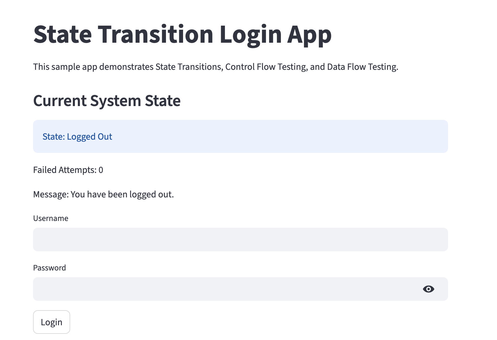
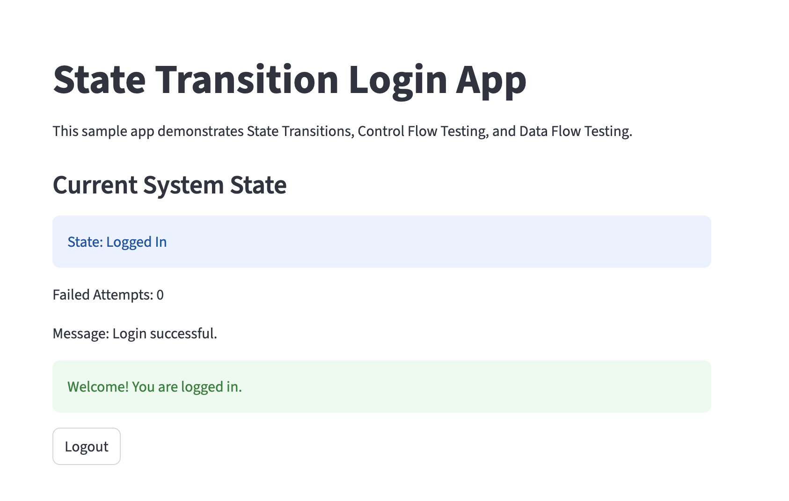
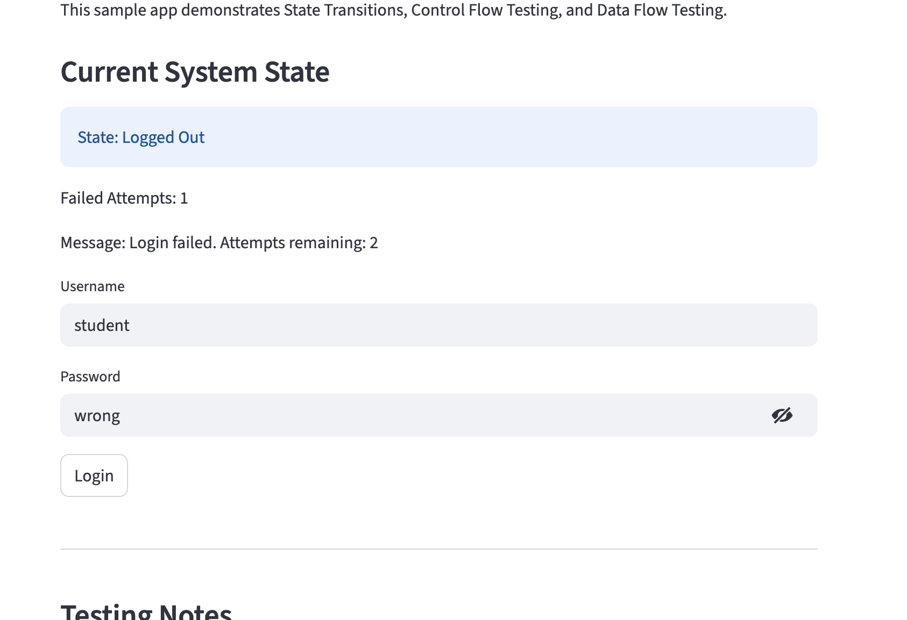
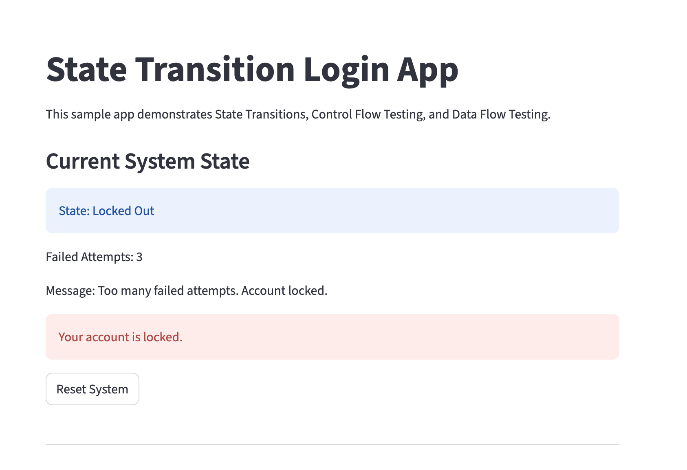
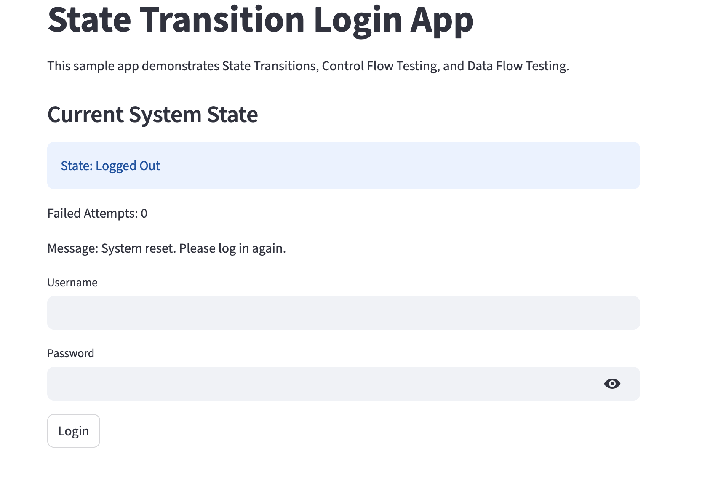

# State Transitions, Control Flow, and Data Flow Testing

## Introduction

This project highlights three key white-box testing techniques: **State Transition Testing, Control Flow Testing, and Data Flow Testing**. These methods are valuable when software behavior relies on event sequences, execution paths, or variable definitions and usage. They assist testers in identifying defects that simple input/output testing might miss.

For this task, I developed a simple **login state machine app** in Python with Streamlit. The app was suitable because it features well-defined states like Logged Out, Logged In, and Locked Out. It also includes branches for success and failure, and tracks variables such as username, password, and attempt count throughout the program.

## Setup

I organized this project in its own folder called `state-flow-testing` to keep it separate from my other class assignments. I chose Python and Streamlit to develop the app because Streamlit simplifies building a straightforward interactive interface for testing.

The steps I followed were:

1. Created a new project folder.
2. Created and activated a virtual environment.
3. Installed Streamlit.
4. Created the main app file.
5. Ran the app locally in the browser.

The app starts in the **Logged Out** state and allows the user to attempt login, logout, or reset after being locked out.

## Test 1 User Story

**As a user, I want to log in with valid credentials so that I can access the system.**

### Expected behavior
- The user enters the correct username and password.
- The app changes from **Logged Out** to **Logged In**.
- The app displays a success message.
- The failed attempt counter resets to zero.

### What this tests
- A valid state transition.
- The success branch in the control flow.
- Proper use of the username and password variables in the data flow.

## Test 2 User Story

**As a user, I want to see what happens when I enter the wrong password so that I can confirm the app handles errors correctly.**

### Expected behavior
- The user enters an incorrect password.
- The app stays in **Logged Out**.
- The failed attempt counter increases.
- The app shows a failure message with remaining attempts.

### What this tests
- A failure state transition that does not change state.
- The error branch in the control flow.
- The update and use of the attempt counter in the data flow.

## Test 3 User Story

**As a user, I want the account to lock after too many failed login attempts so that the system is protected from repeated failures.**

### Expected behavior
- The user enters the wrong password three times.
- The app changes from **Logged Out** to **Locked Out**.
- The app prevents further login attempts.
- The app displays a lockout message.

### What this tests
- A transition into a protected locked state.
- The branch that checks whether the maximum attempts has been reached.
- The use of the attempt counter to control program behavior.

## How I Ran the Tests

I ran the app locally in my browser and manually tested various input combinations. Initially, I confirmed a successful login with the correct username and password. Next, I attempted a failed login with an incorrect password. Lastly, I created multiple failed login attempts to ensure the account would lock after three failures.

I also tested the logout and reset actions to ensure the app returned to the correct state. These tests confirmed that the app functions as a straightforward state machine and that the state transitions aligned with expectations.

## Screenshots

### Initial Logged Out State

### Successful Login

### Failed Login

### Locked Out State

### Reset or Logout

## Conclusion

This project enhanced my understanding of how state transition testing, control flow testing, and data flow testing collaborate. State transition testing demonstrated how the app transitions between different states. Control flow testing allowed me to verify each branch of the login logic. Data flow testing enabled me to trace how variables like attempt count and state are defined and utilized.

My primary issue was ensuring the app maintained the correct state after each action. Additionally, I needed to verify that the attempt counter updated accurately and that the lockout condition triggered correctly after a set number of failures. Utilizing a basic Streamlit app simplified testing, as I could quickly modify inputs and observe the outcomes in the browser.

Overall, I realized that even a simple login app can illustrate various key testing techniques. I also discovered that thorough testing of states, branches, and variables is crucial for creating dependable software.

***
