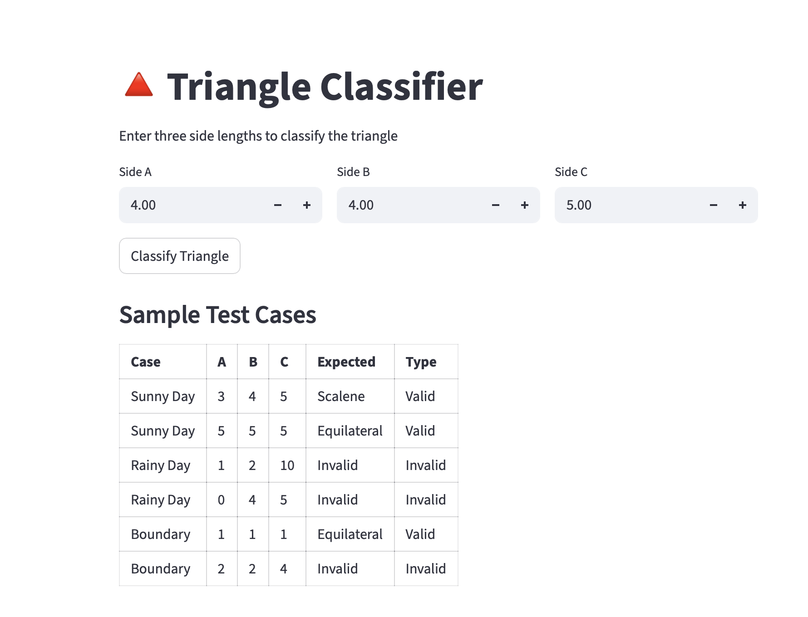
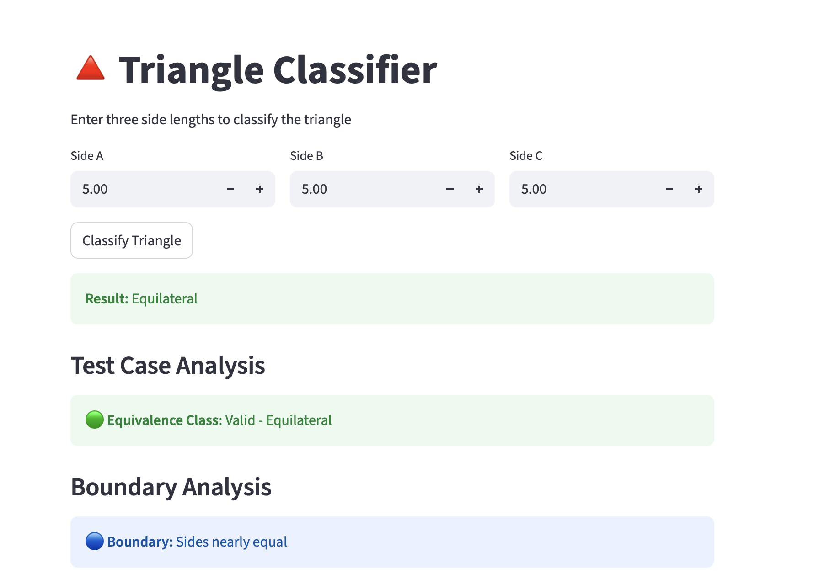
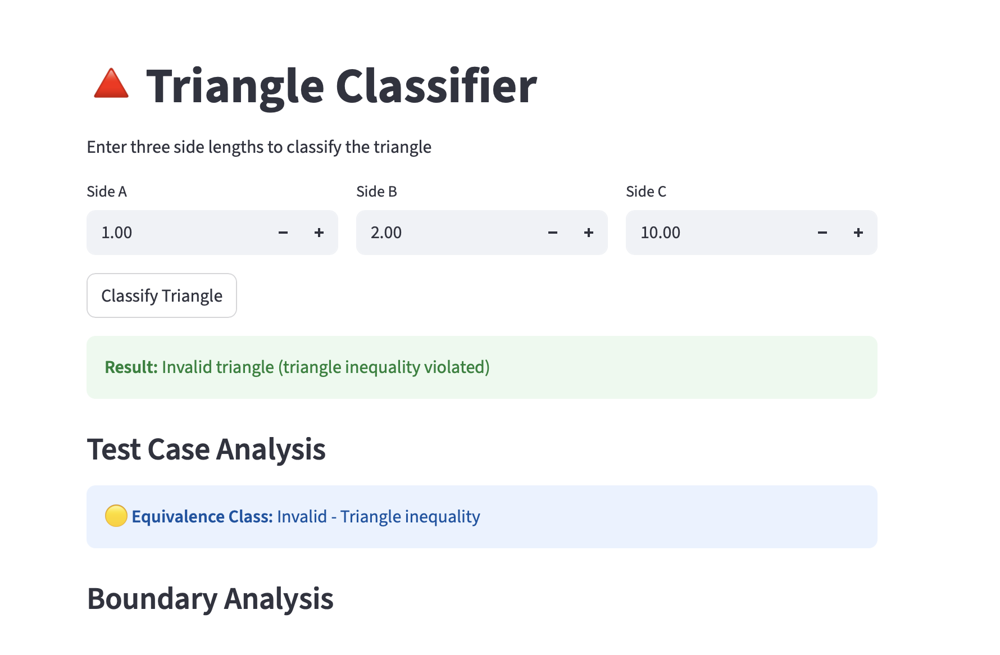
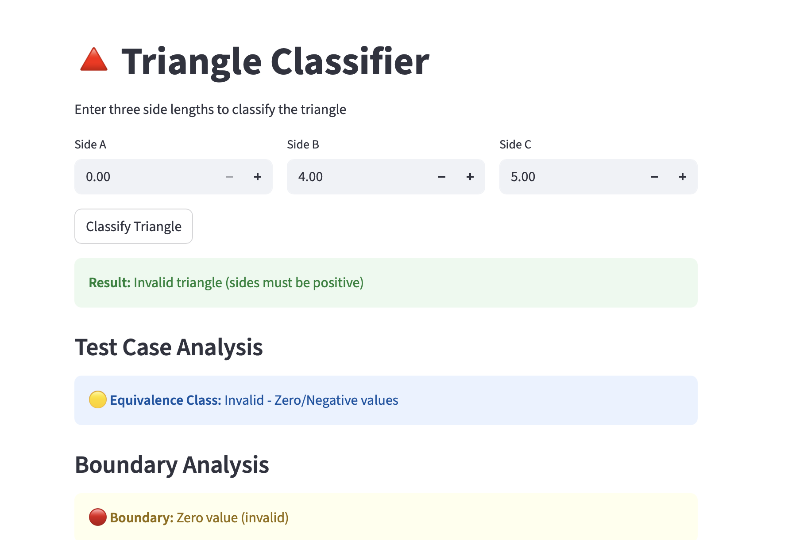
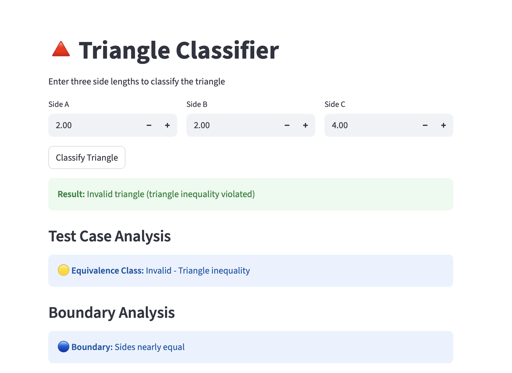
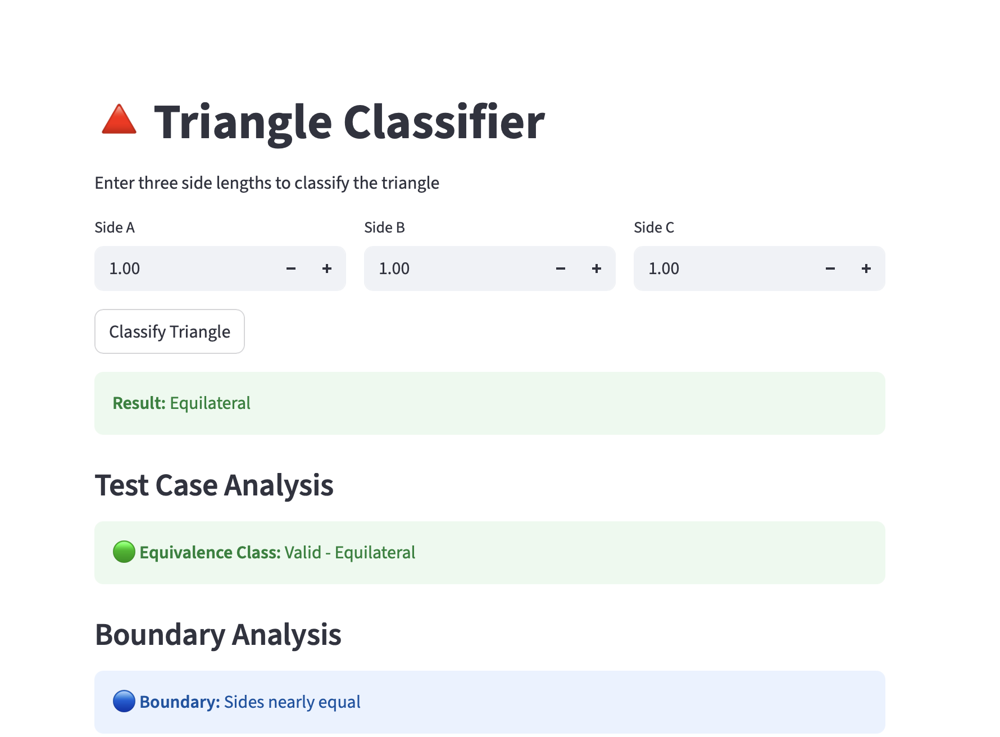
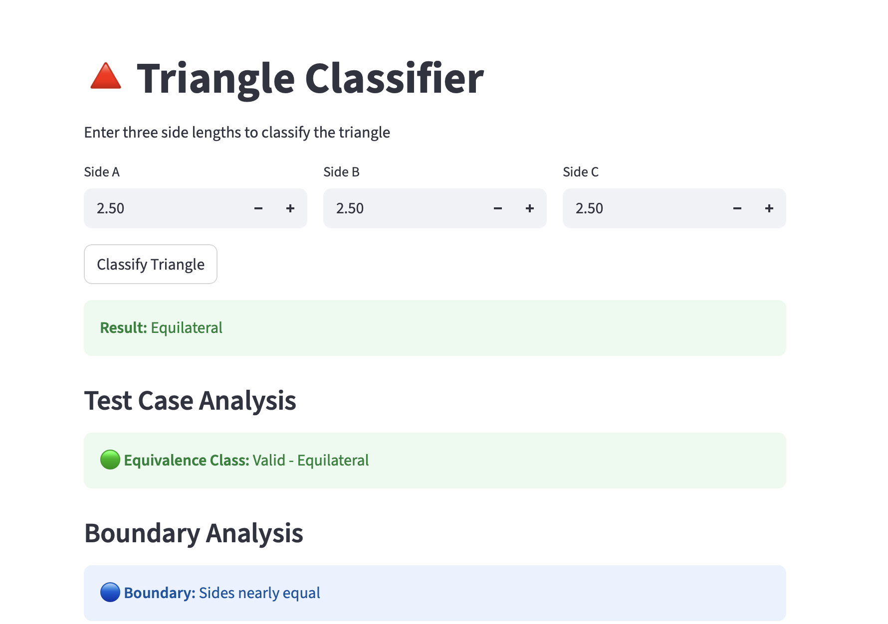
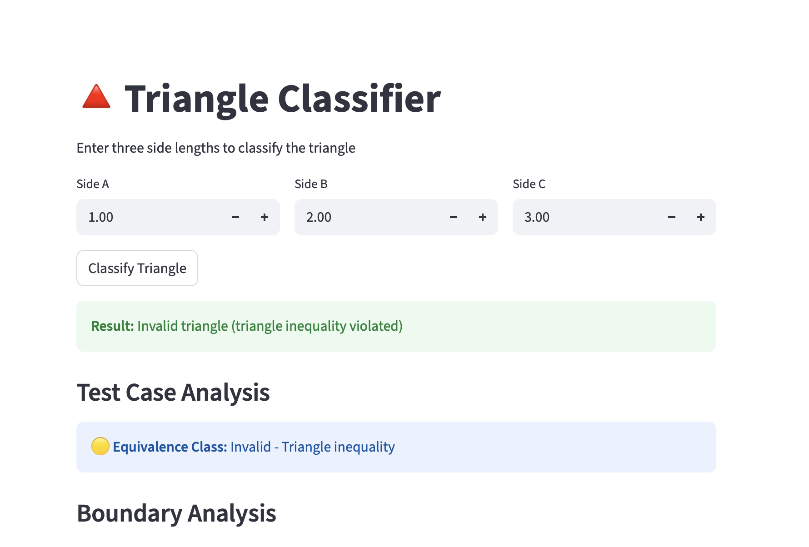
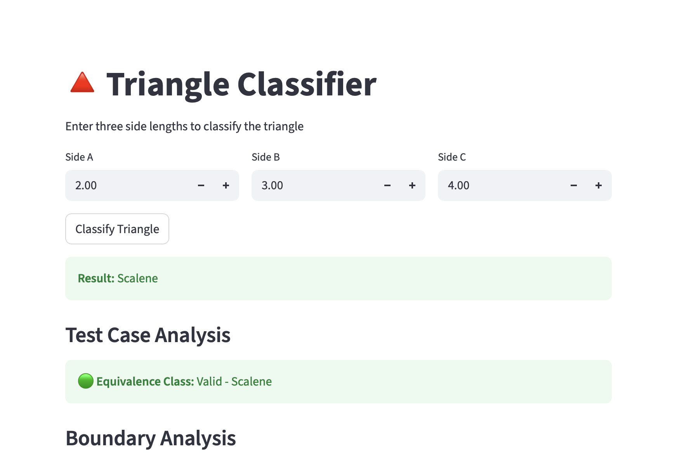

# Vibe Coding Test Case Analysis

## Introduction

This project examines **Equivalence Classes and Boundary Value Testing**, two techniques for designing test cases that help minimize the number of tests while ensuring key input scenarios are covered. The core concept is to partition inputs into groups likely to produce similar responses, then validate one or more examples from each group. Boundary value testing is particularly effective since numerous software issues tend to occur at the edges of valid input ranges.

These techniques are suitable when an application accepts ranges of values like numbers, dates, or sizes. They help identify defects without testing every possible input. However, they do not ensure detection of all bugs, particularly logic errors outside the input range. Nonetheless, they are valuable for catching common input-related issues early in the testing process.

In this assignment, I employed AI-assisted vibe coding to develop a small sample app that illustrates the practical application of equivalence classes and boundary values.

***

## Vibe Coding Assignment

### Sample App Overview

I created a simple **Triangle Classifier app** using Python. The app accepts three side lengths and determines whether the triangle is:

- Valid or invalid
- Equilateral
- Isosceles
- Scalene

This app works well for equivalence class testing because triangle inputs can be grouped into categories such as valid, invalid, zero, negative, decimal, and boundary values.


### Why This App Fits the Topic

Triangle classification is a good example of equivalence classes because:

- Some inputs are clearly valid.
- Some inputs are clearly invalid.
- Some inputs are on the boundary, such as `0`, `1`, or values that barely satisfy the triangle inequality.
- Some inputs are in the middle of a valid range and should behave similarly.

This made it easy to test both sunny-day and rainy-day cases.

***

## Code Example

Here is the core logic used in the app:

```python
def classify_triangle(a, b, c):
    if a <= 0 or b <= 0 or c <= 0:
        return "Invalid triangle"
    if a + b <= c or a + c <= b or b + c <= a:
        return "Invalid triangle"
    if a == b == c:
        return "Equilateral"
    elif a == b or a == c or b == c:
        return "Isosceles"
    else:
        return "Scalene"
```

This code checks for invalid values first, then classifies the triangle if the values are valid.

***

## Sunny Day Scenarios

Sunny day testing means using inputs that should work correctly.

### Sunny Day Test 1

**Input:** `3, 4, 5`  
**Expected Result:** `Scalene`

This is a standard valid triangle and should return a scalene classification.

### Sunny Day Test 2

**Input:** `5, 5, 5`  
**Expected Result:** `Equilateral`

All sides are equal, so this should return equilateral.

### Sunny Day Test 3

**Input:** `5, 5, 8`  
**Expected Result:** `Isosceles`

Two sides are equal, so this should return isosceles.

***

## Rainy Day Scenarios

Rainy day testing means using inputs that should fail or return an error.

### Rainy Day Test 1

**Input:** `1, 2, 10`  
**Expected Result:** `Invalid triangle`

These sides do not satisfy the triangle inequality.

### Rainy Day Test 2

**Input:** `0, 4, 5`  
**Expected Result:** `Invalid triangle`

A triangle side cannot be zero.


### Rainy Day Test 3

**Input:** `2, 2, 4`  
**Expected Result:** `Invalid triangle`

This is a boundary case where the sum of two sides equals the third side, so the triangle is not valid.

***

## Boundary Value Testing

Boundary value testing is useful because errors often happen near the edges of valid input ranges. For this app, the boundary values include:

- `0`, which is invalid
- `1`, which is the smallest valid positive value
- values that barely satisfy or fail the triangle inequality
- decimal values such as `3.5`, `4.2`, `5.1`

### Boundary Test Examples

- `1, 1, 1` → Equilateral
- `1, 2, 3` → Invalid triangle
- `2, 3, 4` → Scalene
- `2.5, 2.5, 2.5` → Equilateral

These tests help confirm that the program behaves correctly at the edges of valid input.

***

## Screenshots

### App Running




### Sunny Day Example





### Rainy Day Example





### Boundary Value Example





***

## What I Learned from AI Tools

Using AI tools greatly sped up the process of creating the sample app and test cases. The AI helped generate the initial code structure, saving time and providing a good starting point. I still needed to review the code, test it, and ensure the results matched the expected triangle rules.

I found that AI tools are valuable for accelerating development, but human review remains essential. The code might require adjustments, and test cases must be selected thoughtfully. Additionally, I learned that using equivalence classes and boundary values helps minimize unnecessary tests while ensuring key conditions are tested.

***

## Conclusion

This project enhanced my understanding of how equivalence class testing and boundary value testing function in software testing. The triangle classifier example illustrated how inputs can be categorized as valid or invalid, and demonstrated how boundary cases can help identify potential problems.

Overall, I found that AI-assisted coding is a valuable tool for rapidly developing sample applications, though thorough testing remains essential to confirm functionality. This assignment enhanced my knowledge of test design, edge case identification, and more effective software evaluation.

***

